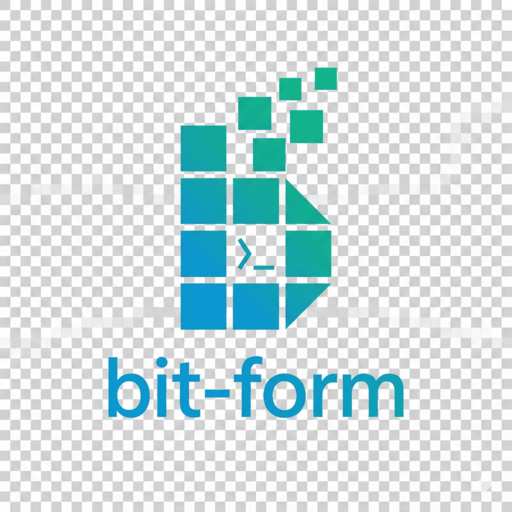

<div align="center">
  
</div>

<p align="center">
  <i>Made with ❤️ by <a href="https://github.com/lehnihon">lehnihon</a> & contributors</i>
</p>

<p align="center">
  <a href="https://github.com/lehnihon/bit-form/actions/workflows/ci.yml">
    
  </a>
  <a href="https://github.com/lehnihon/bit-form/actions/workflows/ci.yml">
    
  </a>
  <a href="https://www.npmjs.com/package/@lehnihon/bit-form">
    
  </a>
  <a href="https://www.npmjs.com/package/@lehnihon/bit-form">
    
  </a>
  <a href="https://github.com/lehnihon/bit-form/stargazers">
    
  </a>
  <a href="https://github.com/lehnihon/bit-form/network/members">
    
  </a>
  <a href="https://github.com/lehnihon/bit-form/issues">
    
  </a>
  <a href="https://github.com/lehnihon/bit-form/blob/main/LICENSE">
    
  </a>
  
  
</p>

---

# 🛠 Bit-Form

**Agnostic and performant form state management**.

Bit-Form is a powerful, framework-agnostic library designed to handle complex validations, dynamic masks, and conditional logic seamlessly across modern frontend ecosystems. Build your logic once, use it anywhere.

## ✨ Key Features

- **Framework Agnostic Core:** Dedicated bindings for React, Vue, and Angular.
- **First-Class Validation:** Built-in schema resolvers for Zod, Yup, and Joi. Includes native support for debounced asynchronous validation.
- **Advanced Masking System:** Extensive list of presets including Currency (BRL, USD, EUR), Documents (CPF, CNPJ, SSN), Dates, and Credit Cards.
- **Smart Dependencies:** Built-in dependency manager to conditionally hide or require fields using `showIf`, `requiredIf`, and `dependsOn`.
- **Computed Fields:** Automatically calculate and update form values in real-time based on other field changes.
- **Field Arrays:** First-class support for dynamic lists with native methods to append, prepend, move, and swap items.
- **Draft Persistence:** Optional draft persistence with autosave, manual restore, manual clear, and custom storage adapters (Web `localStorage`, React Native `AsyncStorage`, or your own adapter).
- **Lifecycle Plugins:** Plugin system for lifecycle observability (`beforeValidate`, `afterValidate`, `beforeSubmit`, `afterSubmit`, `onFieldChange`, `onError`).
- **Time-Travel DevTools:** Full history support with Undo/Redo capabilities and a Remote Inspector CLI via WebSocket.

## 🏎 Performance & Comparison

Bit-Form was built to solve the "heavy form" problem. While most libraries re-render the entire form or require complex memoization to handle dynamic masks and deep validations, Bit-Form uses a subscription-based model that updates only the specific field being touched.

### Comparison Table

#### React Ecosystem

| Feature                     | **Bit-Form** | React Hook Form |  Formik   | TanStack Form |
| :-------------------------- | :----------: | :-------------: | :-------: | :-----------: |
| **Framework Agnostic**      |    ✅ Yes    |      ❌ No      |   ❌ No   |    ✅ Yes     |
| **Built-in Masking**        | ✅ Advanced  |      ❌ No      |   ❌ No   |     ❌ No     |
| **Re-renders**              |  ⚡ Minimal  |   ⚡ Minimal    |  🐢 High  |  ⚡ Minimal   |
| **Conditional Logic**       |  ✅ Native   |    ⚠️ Manual    | ⚠️ Manual |   ✅ Native   |
| **Time-Travel (Undo/Redo)** |  ✅ Native   |      ❌ No      |   ❌ No   |     ❌ No     |
| **Remote DevTools**         |    ✅ Yes    |      ❌ No      |   ❌ No   |     ❌ No     |
| **Computed Fields**         |  ✅ Native   |      ❌ No      |   ❌ No   |   ⚠️ Manual   |

#### Vue Ecosystem

| Feature                     | **Bit-Form** | VeeValidate |  FormKit   |
| :-------------------------- | :----------: | :---------: | :--------: |
| **Framework Agnostic**      |    ✅ Yes    |    ❌ No    |   ❌ No    |
| **Built-in Masking**        | ✅ Advanced  |    ❌ No    | ⚠️ Plugins |
| **Re-renders**              |  ⚡ Minimal  | ⚡ Minimal  | ⚡ Minimal |
| **Conditional Logic**       |  ✅ Native   |  ⚠️ Manual  | ✅ Native  |
| **Time-Travel (Undo/Redo)** |  ✅ Native   |    ❌ No    |   ❌ No    |
| **Remote DevTools**         |    ✅ Yes    |    ❌ No    |   ❌ No    |
| **Computed Fields**         |  ✅ Native   |    ❌ No    | ⚠️ Manual  |

#### Angular Ecosystem

| Feature                     | **Bit-Form** | Angular Reactive Forms | ngx-formly |
| :-------------------------- | :----------: | :--------------------: | :--------: |
| **Framework Agnostic**      |    ✅ Yes    |         ❌ No          |   ❌ No    |
| **Built-in Masking**        | ✅ Advanced  |         ❌ No          |   ❌ No    |
| **Re-renders**              |  ⚡ Minimal  |       ⚡ Minimal       | ⚡ Minimal |
| **Conditional Logic**       |  ✅ Native   |       ⚠️ Manual        | ✅ Native  |
| **Time-Travel (Undo/Redo)** |  ✅ Native   |         ❌ No          |   ❌ No    |
| **Remote DevTools**         |    ✅ Yes    |         ❌ No          |   ❌ No    |
| **Computed Fields**         |  ✅ Native   |       ⚠️ Manual        | ⚠️ Manual  |

### Benchmark Results

Below are **measured results** from the quality benchmarks currently in this repository (no estimated/extrapolated values).

- Source tests:
  - `quality/bench/rhf-compare.test.ts`
  - `quality/bench/perf.test.ts`
- Reproduce with:
  - `npm run test:bench:compare`
  - `npm run test:bench`

#### React benchmark (Bit-Form vs React Hook Form)

Snapshot measured on **20/03/2026**:

| Scenario (lower is better) | Bit-Form (median / p95) | RHF (median / p95) | Ratio Bit/RHF   |
| :------------------------- | :---------------------- | :----------------- | :-------------- |
| Bulk update (300 fields)   | **2.49ms / 5.32ms**     | 113.26ms / 117.7ms | **0.02 / 0.05** |
| Async burst (120 updates)  | **5.58ms / 8.36ms**     | 33.97ms / 36.71ms  | **0.16 / 0.23** |

#### Internal performance baseline (Bit-Form)

Latest baseline from `quality/bench/perf.test.ts`:

- 300 field updates: ~20ms
- 1000 field updates in transaction + history: ~45ms
- 400 scoped subscribers: ~9ms
- Async validation burst: ~16ms
- Computed chain fanout (50): ~60ms
- Subscription notify fanout (200): ~15ms

> **Note:** benchmark values vary by machine, Node version, and CI load. Thresholds are calibrated from measured data with CI headroom and are validated in `quality/bench`.

### Why Bit-Form?

1.  **Zero-Reflow Masking:** Unlike other libs where masking causes a double-render (one for the raw value, one for the mask), Bit-Form handles masks at the store level before the UI even knows about it.
2.  **Logic Portability:** You can share the exact same `BitStore` instance (including validations and masks) between a React web app and an Angular admin dashboard.
3.  **Predictable State:** With the History Manager, you can track exactly how the form state evolved, making it the best choice for complex, multi-step financial or insurance forms.

## 📦 Installation

```bash
npm install @lehnihon/bit-form
```

## 📚 Documentation

The complete documentation is available in the `/docs` folder. Explore the guides below to get started:

### 🚀 Getting Started

- **[Introduction & Installation](./docs/01-getting-started.md)**: Overview and basic setup.
- **[Core Concepts](./docs/02-core-concepts.md)**: Understanding the `BitStore` and state lifecycle.

### 🖼 Framework Guides

- **[React](./docs/frameworks/react.md)**: Using hooks and Context Provider.
- **[Next.js](./docs/frameworks/next.md)**: Using Bit-Form in App Router/Pages Router with client boundaries (`"use client"`).
- **[React + shadcn/ui](./docs/frameworks/react-shadcn.md)**: Generate form wrappers with `bit-form add shadcn` (Input, Textarea, Select, Checkbox, Switch, RadioGroup).
- **[React Native](./docs/frameworks/react-native.md)**: Mobile specifics and `onChangeText` mapping.
- **[Vue](./docs/frameworks/vue.md)**: Using composables and InjectionKeys.
- **[Angular](./docs/frameworks/angular.md)**: Reactive forms via Signals.

### 🛠 Features

- **[Validation & Resolvers](./docs/features/validation.md)**: Integrating Zod, Yup, and Joi.
- **[Masks & Formatting](./docs/features/masks.md)**: Using and creating input masks.
- **[Conditional Logic](./docs/features/conditional-logic.md)**: Managing field dependencies.
- **[Computed Fields](./docs/features/computed-fields.md)**: Handling derived form values.
- **[Field Arrays](./docs/features/field-arrays.md)**: Managing dynamic lists of fields.
- **[Draft Persistence](./docs/features/persistence.md)**: Save, restore, and clear local drafts with `useBitPersist`/`injectBitPersist` and store-level `persist` config.
- **[Lifecycle Plugins](./docs/features/plugins.md)**: Add plugins to observe validation/submit/field-change events with fail-open behavior.
- **[File Uploads](./docs/features/file-uploads.md)**: Backend-first upload integration with `useBitUpload` and `injectBitUpload`.
- **[Scopes](./docs/features/scopes.md)**: Per-step validation and status for wizard forms (`useBitScope`, `injectBitScope`).
- **[History & Time Travel](./docs/features/history-and-time-travel.md)**: Using Undo/Redo features.

### 📖 Guides & Examples

- **[When to Use What](./docs/guides/when-to-use-what.md)**: Quick reference for resolver vs asyncValidate vs setServerErrors, computed vs transform, and conditional fields.
- **[Complete Form Example](./docs/examples/complete-form-example.md)**: End-to-end example with masks, asyncValidate, conditional logic, scopes, history, and DevTools.
- **[Upload Integration Example](./docs/examples/upload-integration-example.md)**: Backend-first upload example using `useBitUpload`/`injectBitUpload`.
- **[Server Errors](./docs/examples/server-errors.md)**: Client validation (resolver/asyncValidate) vs API 422 handling (setServerErrors, onSubmit).

### 🔍 DevTools & CLI

- **[DevTools Overview](./docs/devtools/index.md)**: Configuration (`devTools: true` or `{ mode: "remote" }`).
- **[Floating Panel](./docs/devtools/floating-panel.md)**: In-app inspector (local mode).
- **[CLI & Remote Dashboard](./docs/devtools/cli-remote-dashboard.md)**: `bit-form devtools` + WebSocket for React Native / remote debugging.
- **CLI `add`**: Generate Bit-Form + shadcn/ui wrappers with `bit-form add shadcn [input|textarea|select|checkbox|switch|radio-group]` — see [React + shadcn](./docs/frameworks/react-shadcn.md).

### 📑 Reference

- **[API Reference](./docs/api-reference/bit-store.md)**: Full `BitStore` class documentation.
- **[Type Definitions](./docs/api-reference/types.md)**: Core TypeScript interfaces and types.

## ⚠️ Breaking Changes (dev branch)

This branch currently allows breaking changes while architecture/performance work is in progress.

- **History default limit changed** from `15` to `50` (`history.limit`).
- **Selector subscriptions no longer rely on deep value diff inference** when no `paths` are provided internally; updates are now path-driven for predictable performance.
- **New `subscribeTracked`** was added to auto-track selector dependencies and re-track when selector branches change.
- **`resolveBitStoreForHooks` now uses symbol branding** instead of duck-typing checks.
- **SSR/Edge support improved** with injectable bus instances (`createBitBus`, `config.bus`, `initDevTools({ bus })`).

### Migration quick notes

- If you relied on implicit broad selector notifications, prefer explicit `paths` or use `subscribeTracked`.
- If you need old history density, set `history: { limit: 15 }` explicitly.
- In SSR/Edge runtimes, create one bus per request scope and inject it into the store and DevTools.

## 🤝 Contributing

Contributions are welcome! Feel free to open issues or submit pull requests.

## 📄 License

MIT
